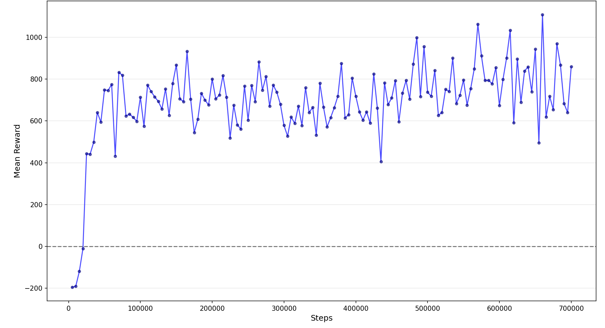

#  PPO Snake

This repository implements a Snake agent trained with Proximal Policy Optimization (PPO) using a 16-dimensional observation space. The trained policy is exported as JSON and runs in the browser.  
👉 [Open Demo](https://karatelb5.github.io/rl_snake/)

###  Observation Space

```text
[danger_straight, danger_left, danger_right,
 dir_up, dir_down, dir_left, dir_right,
 food_up, food_down, food_left, food_right,
 head_x, head_y, tail_x, tail_y, snake_length]
```
###  Reward Shaping

After experiments and training, the most effective features were identified:

- +20 for eating an apple
- -25 for death
- -0.1 per step
- +0.3 if agent moves closer to food
- -0.3 if agent moves away from food
- -10 if max step limit (2.000) is reached without finishing episode


##  Results

| Metric | Value |
| :--- | :--- |
| **Algorithm** | PPO  |
| **Observation Space** | 16 dimensions  |
| **Network Architecture** | MLP [128, 128] |
| **Training Steps** | 700k |
| **Mean Reward** | 917 |
| **Best Mean Reward** | 1106 |
| **Avg. Apples / Episode** | 45.4 |
| **Mean Episode Length** | 704 |
| **Explained Variance** | 0.87 ± 0.06 |


###  Training Curve


##  Testing a Pre-trained Model

Run a local server:

```bash
cd web && python -m http.server 8000
````

Open:

```
http://localhost:8000
```

The interface supports real-time interaction with the trained agent, including step-by-step debugging and speed adjustment.

The model loads automatically from:

```
web/models/weights.json
```

---

##  Training

Run training using default configuration:

```bash
python main.py
```

### Custom training

```bash
python main.py --steps 700000 --grid 25 --lr 2e-4 --ent 0.005
python main.py --export models/custom_weights.json
```

---

##  Arguments

| Argument | Default                 | Description              |
| :------- | :---------------------- | :----------------------- |
| --steps  | 500000                  | Total training timesteps |
| --grid   | 20                      | Grid size (N × N)        |
| --export | web/models/weights.json | Path for JSON export     |
| --lr     | 3e-4                    | Learning rate            |
| --ent    | 0.01                    | Entropy coefficient      |

---

